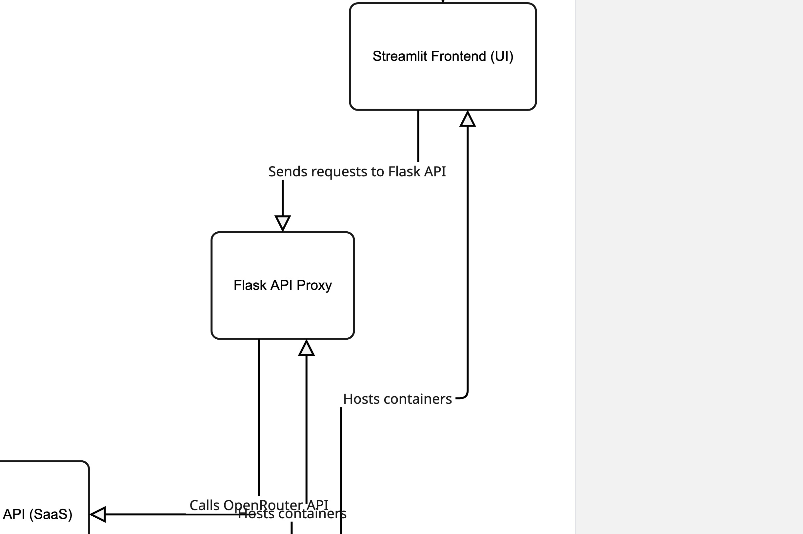

# DT1-25 — AI Chat System using Docker, OpenRouter & GCP

**Author:** Alexander Thuo  
**Institution:** Berner Fachhochschule  
**Evaluator:** Sid Singh (sid027)  
**Assignment:** DT1-25 Practical Deployment  
**Date:** October 2025  

---

## 🧠 Project Overview

This project implements a **two-container AI chat system** deployed on **Google Cloud Platform (GCP)** using **Docker Compose**.  
It integrates a **Flask backend API** and a **Streamlit frontend UI**, which together allow users to input prompts and receive AI-generated responses via the **OpenRouter DeepSeek model**.

The backend uses the **DeepSeek Chat v3.1 (free)** model hosted on **OpenRouter**, and all components are containerized using Docker for consistent and isolated deployments.

---

## 🧩 System Architecture

### Architecture Diagram



---

## 🧱 Technologies Used

| Component  | Technology Stack                        |
|-------------|------------------------------------------|
| Frontend    | Streamlit (Python)                       |
| Backend     | Flask (Python)                           |
| Model API   | OpenRouter API                           |
| Model       | DeepSeek Chat v3.1 (Free)                |
| Deployment  | Docker Compose on GCP VM                 |
| Registry    | Docker Hub (Public & Private Repos)      |
| Hosting     | Google Cloud Platform (Compute Engine)   |

---

## ⚙️ Setup & Deployment Steps

### 1️⃣ Clone the Repository
```bash
git clone https://github.com/<your-username>/alexander_thuo-dt1-25.git
cd alexander_thuo-dt1-25

2️⃣ Build Docker Images Locally
docker compose build

3️⃣ Run Locally
docker compose up

4️⃣ Push Docker Images to Docker Hub

API (Private):

docker push alexthuo/dt1-25-api:latest


Frontend (Public):

docker push alexthuo/dt1-25-frontend:latest

5️⃣ Deploy on GCP VM

SSH into the VM and run:

docker compose up -d

🌐 Deployment Details
Component	URL / Access
Frontend (Streamlit)	http://<YOUR_EXTERNAL_IP>:8501
Backend API (Flask)	http://<YOUR_EXTERNAL_IP>:5001
Docker Hub (Frontend)	https://hub.docker.com/r/alexthuo/dt1-25-frontend

Docker Hub (API)	Private Repository (access restricted)
GitHub Repo	Private — alexander_thuo-dt1-25
🔐 Security & Firewall Configuration

The deployed VM is secured through Google Cloud Firewall rules:

Only my personal IP and Sid Singh’s CIDR (as provided) have SSH and backend access.

Backend (Port 5001): Accessible only internally by the frontend container.

Frontend (Port 8501): Publicly accessible for evaluation.

All other inbound connections are blocked.

🧮 Frontend Features

✅ Input text field for user prompts

✅ Dropdown for model selection (default: deepseek/deepseek-chat-v3.1:free)

✅ “Submit” button to send the request to the backend

✅ Displays the AI response neatly in a text area

✅ “Clear Chat” button to reset the input field

✅ Simple and responsive Streamlit UI

🧰 Backend API Endpoints

Base URL: http://<YOUR_EXTERNAL_IP>:5001

Endpoint	Method	Description
/chat	POST	Accepts JSON { "prompt": "Hello" } and returns AI-generated response
/health	GET	Returns a simple “API is running” status message
Example Request
curl -X POST http://<YOUR_EXTERNAL_IP>:5001/chat \
     -H "Content-Type: application/json" \
     -d '{"prompt": "Hello"}'

Example Response
{
  "model": "deepseek/deepseek-chat-v3.1:free",
  "response": "Hi there! How can I assist you today?"
}

☁️ Google Cloud VM Configuration
Setting	Details
Instance Type	e2-medium (2 vCPU, 4 GB RAM)
OS	Ubuntu 22.04 LTS
Installed Tools	Docker, Docker Compose, Python 3.10
Ports Opened	8501 (Frontend), 5001 (Backend)
Firewall	Restricted to my IP + evaluator’s CIDR